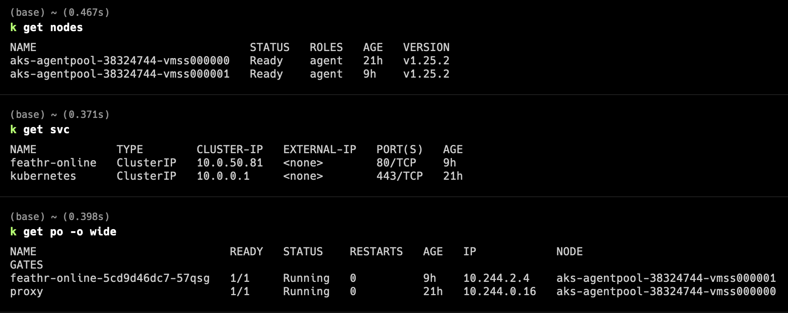

# feathr-online-benchmark

Note for feathr online benchmark testing

## Infra setup

- Provision AKS with 2 nodes, sku Standard_D8s_v3 (8 cores, 32GB)

- Deploy an ubuntu Test agent pod in node 1, run following command to install test tool
  
  ```bash
  apt update
  apt install apache2-utils
  ```

- Deploy a feathr online service in node 2, run following command to install test tool
  
  ```bash
  apk add apache2-utils
  ```

Output of `k get nodes`, `k get svc`, `k get po -o wide`


## Benchmark Result

Total Request: 1000000

Concurrency: 300

| Use Case                                                 | P95  | P99  | RPS   |
| -------------------------------------------------------- | ---- | ---- | ----- |
| Agent and feathr in same pod                             | 15ms | 19ms | 36598 |
| Agent and feathr in different pods, talk thru node ip    | 18ms | 23ms | 29304 |
| Agent and feathr in different pods, talk thru service ip | 18ms | 23ms | 29300 |

## Agent and feathr in same pod

Launch test

```bash
kubectl exec -it feathr-online-5cd9d46dc7-57qsg -- /bin/sh
ab -k -c 300 -n 1000000 http://localhost:8000/healthz
```

Result:

```text
Requests per second:    36598.34 [#/sec] (mean)
Time per request:       8.197 [ms] (mean)
Time per request:       0.027 [ms] (mean, across all concurrent requests)
Transfer rate:          5075.16 [Kbytes/sec] received
Percentage of the requests served within a certain time (ms)
  50%      8
  66%      9
  75%     11
  80%     11
  90%     13
  95%     15
  98%     17
  99%     19
 100%     38 (longest request)
```

## Agent and feathr in different pods, talk thru node ip

Launch test

```bash
kubectl exec -it proxy -- bash
ab -k -c 300 -n 1000000 http://10.244.2.4:8000/healthz
```

Output:

```text
Requests per second:    29304.89 [#/sec] (mean)
Time per request:       10.237 [ms] (mean)
Time per request:       0.034 [ms] (mean, across all concurrent requests)
Transfer rate:          4063.76 [Kbytes/sec] received
Percentage of the requests served within a certain time (ms)
  50%     10
  66%     12
  75%     13
  80%     14
  90%     16
  95%     18
  98%     21
  99%     23
 100%     40 (longest request)
```

## Agent and feathr in different pods, talk thru service ip

Launch test

```bash
kubectl exec -it proxy -- bash
ab -k -c 300 -n 1000000 http://10.0.50.81/healthz
```

Output:

```text
equests per second:    29300.91 [#/sec] (mean)
Time per request:       10.239 [ms] (mean)
Time per request:       0.034 [ms] (mean, across all concurrent requests)
Transfer rate:          4063.21 [Kbytes/sec] received
Percentage of the requests served within a certain time (ms)
  50%     10
  66%     12
  75%     13
  80%     14
  90%     16
  95%     18
  98%     21
  99%     23
 100%     37 (longest request)
```
